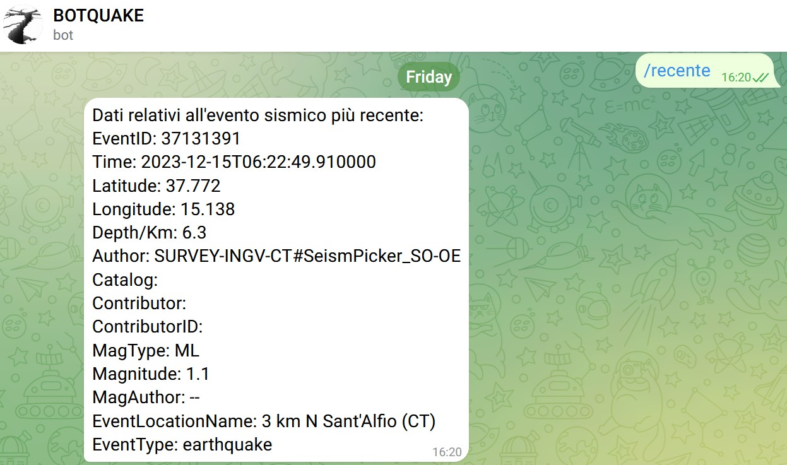
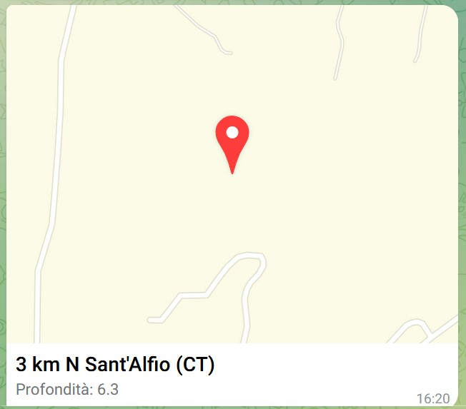
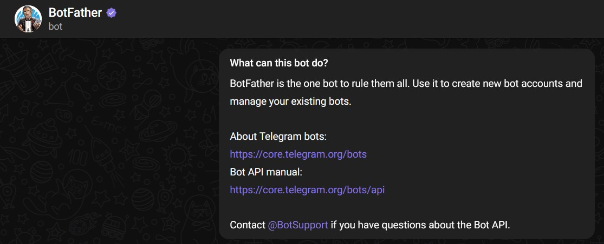
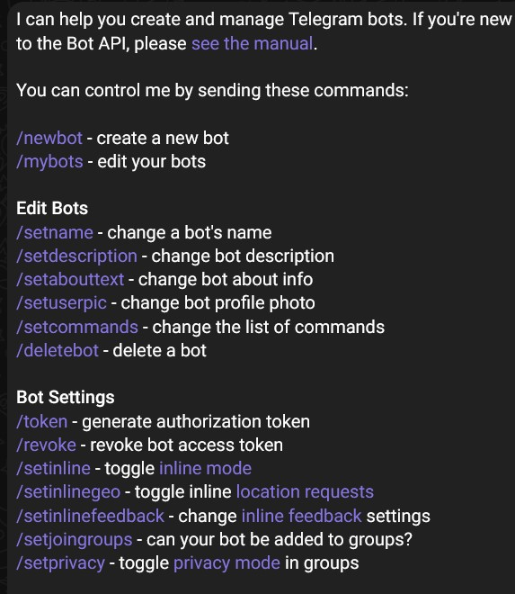

## Botquake
Botquake è un progetto per il corso di Quality Development
### Cosa ci proponiamo di realizzare
Ciò che si intende realizzare è un BOT Telegram, ovvero una applicazione eseguita sulla nostra macchina la quale comportandosi da server estenderà le funzionalità del server di Telegram, al quale un utente potrà inviare comandi mediante l'interfaccia di chat messa a disposizione dal client di Telegram. Il comando sarà reindirizzato alla nostra macchina che darà risposta tramite il server Telegram al client dal quale l'utente ha inviato il comando.
#### Specifiche dell'applicazione Botquake
L'applicazione elaborerà i dati forniti sul sito https://terremoti.ingv.it/ dall'Ingv,sotto licenza Creative Commons Attribution 4.0 International https://creativecommons.org/licenses/by/4.0/.
I dati fanno parte di una database di eventi relativi a diverse reti di rilevazione mondiale di terremeventi sismici, per il nostro scopo restringeremo la zona di interesse all'area Etnea.
L'utente potrà interagire con il Bot tramite appositi comandi, in particolare potra richiedere i dati sull'ultimo terremoto avvenuto nell'area di interesse, nonchè potra affinare la ricerca con un apposito comando impostando una magnitudine massima.

Alla richiesta il bot risponderà con i dati dell'ultimo terremoto relativo al comando inviato.
Seguirà una mappa relativa al luogo dell'evento con il grado di magnitudine dell'evento sismico rilevato.

###
@startuml
boundary    Boundary    as P0
actor       Utente as P1
P0 -> P1 : To messaggio verso il Bot 
@enduml

### BotFather 
#### Inizializzazione del Bot
##### Ottenere la chiave API per il BOT:
Dobbiamo aprire la versione desktop o la versione mobile di Telegram, quindi cercare 'BotFather' come mostrato nella figura.

Bisogna per prima cosa inizializzare attraverso la chat di Telegram BotFather la chat Bot per il nostro progetto, impostare il nome del Bot e l'identificativo che deve terminare con il suffisso bot, per fare questo basta seguire l'albero dei comandi come dalla figura sotto.

#### Chiave di autenticazione del Bot
Una volta finito il primo step, BotFather ci assegnerà un token che sarà la chiave di autenticazione del nostro progetto sul server Telegram
#### Libreria telegram per python
La libreria python-telegram-bot https://pypi.org/project/python-telegram-bot/ ci servirà per interagire con le API di Telegram questa permetterà di impostare la comunicazione tra la il server telegram e l'applicazione in esecuzione sulla nostra macchina.

## Requisiti
Python versione 3.11.0
### Librerie Python
python-telegram-bot  13.13
#### Comandi utili
python --version :ritorna la versione di python installata sul sistema
pip3 list : ritorna la lista delle librerie python installate

